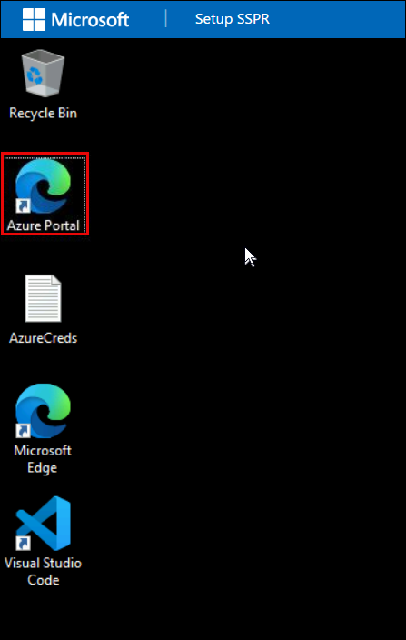
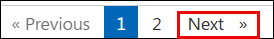

# Getting Started with Setup Hybrid Identity with On-Prem AD and Entra ID

### Overall Estimated Duration: 2 Hours

## Overview

In this lab, you will explore the Hybrid Identity experience with Microsoft Entra ID. You will learn how to seamlessly integrate on-premises Active Directory with Entra ID to implement a robust hybrid identity solution. Through guided steps and practical scenarios, this lab will equip you with the skills needed to manage identities across both on-premises and cloud environments.

## Objectives

By completing this lab, you will gain a foundational understanding of designing, deploying, and managing a Hybrid Identity solution using Microsoft Entra ID:

- Configure Active Directory Domain Services (AD DS).
- Synchronize on-premises AD identities with Microsoft  Entra ID using Microsoft Entra Connect.
- Understand the architecture of a Hybrid Identity solution.

## Architecture

- **Hybrid Identity Framework** integrates on-premises Active Directory with Microsoft Entra ID to enable enterprise-scale identity management and governance. **Active Directory Domain Services (AD DS)** serves as the on-premises identity foundation, managing users, groups, and resources within the corporate network. **Microsoft Entra Connect** facilitates seamless directory synchronization between on-premises AD and Microsoft Entra ID, enabling unified identity management across cloud and on-premises environments.

## Explanation of Components

- **Microsoft Entra ID:** Microsoft Entra ID is a cloud-based identity and access management service that provides single sign-on (SSO), multi-factor authentication (MFA), and conditional access capabilities. It serves as the central identity provider for cloud and hybrid environments, enabling organizations to authenticate users, manage application access, and enforce security policies across the organization.

- **Active Directory Domain Services (AD DS):** Active Directory Domain Services is the on-premises identity management system that manages users, computers, and resources within a corporate network. It provides authentication, authorization, and directory services, forming the foundation of on-premises identity infrastructure and requiring synchronization with cloud services through tools like Microsoft Entra Connect.

- **Microsoft Entra Connect:** Microsoft Entra Connect is a synchronization tool that bridges on-premises Active Directory with Microsoft Entra ID, enabling bidirectional identity synchronization. It ensures that user accounts, groups, and contacts are consistently maintained across both environments, while supporting password writeback for on-premises password changes initiated from the cloud.

## Accessing Your Lab Environment

Once you're ready to dive in, your virtual machine and lab guide will be right at your fingertips within your web browser.

### Virtual Machine & Lab Guide
 
Your virtual machine is your workhorse throughout the workshop. The lab guide is your roadmap to success.

## Exploring Your Lab Resources
 
To get a better understanding of your lab resources and credentials, navigate to the **Environment** tab.

## Utilizing the Split Window Feature
 
For convenience, you can open the lab guide in a separate window by selecting the **Split Window** button from the Top right corner.

 
## Managing Your Virtual Machine
 
Feel free to start, stop, or restart your virtual machine as needed from the **Resources** tab. Your experience is in your hands!

## Let's Get Started with Azure Portal

1. On your Lab virtual machine, click on the **Azure Portal** icon to sign in to the Azure.

        

1. On the Sign in blade, you will see a login screen, in which enter the following email/username and password and then click on Sign in.

    * **Azure Username/Email:**  <inject key="AzureAdUserEmail"></inject>

        

    * **Temperory Access Pass**:  <inject key="AzureAdUserPassword"></inject>

        **Note**: Refer to the **Environment** tab for any other lab credentials/details.

        
  
1. If you see the pop-up **Stay Signed in?** click **Yes**.

    

1. If you see the pop-up **You have free Azure Advisor recommendations!** close the window to continue the lab. 

1. If a **Welcome to Microsoft Azure** popup window appears, click **Maybe Later** to skip the tour.

    

## Support Contact

The CloudLabs support team is available 24/7, 365 days a year, via email and live chat to ensure seamless assistance at any time. We offer dedicated support channels tailored specifically for both learners and instructors, ensuring that all your needs are promptly and efficiently addressed.

Learner Support Contacts:

- Email Support: cloudlabs-support@spektrasystems.com
- Live Chat Support: https://cloudlabs.ai/labs-support

Click **Next** from the bottom right corner to embark on your Lab journey!

### Happy Learning!!
