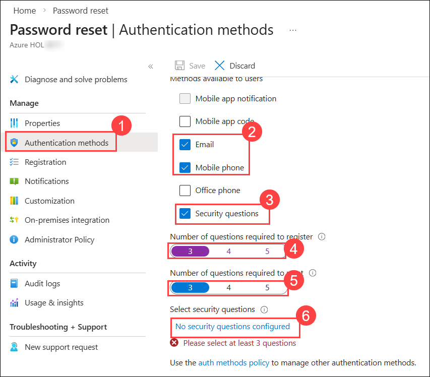
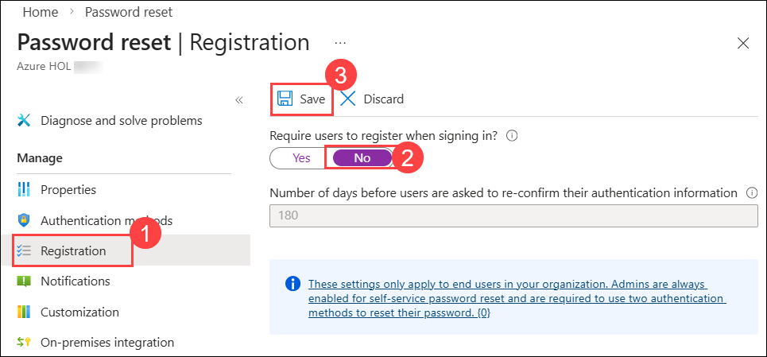

# Lab 02: Configuring Self-service password reset for user accounts in Entra ID

### Estimated Duration: 45 Minutes

## Overview 

This lab focuses on configuring Entra Connect with password writeback, updating the minimum password age policy to 0, enabling self-service password reset with authentication methods via Microsoft Entra Admin Center, and validating by changing a password via the My Account page in Microsoft Edge.

## Objectives

In this lab, you will perform the following:
- Task 1: Enable self-service password reset
- Task 2: Validate self-service password reset

### Task 1: Enable self-service password reset

1. Open **Microsoft Edge** browser in your LabVM, and navigate to Microsoft Entra Admin Center using the following URL:

    ```
    https://entra.microsoft.com
    ```

2. If prompted, sign in as  **<inject key="AzureAdUserEmail"></inject>**, and use the Temporary Access Pass as **<inject key="AzureAdUserPassword"></inject>**, If the **Stay signed in?** prompt appears, select **No**.   

3. In the Microsoft Entra admin center, Navigate to the Search Resources section of the site.

4. In the search box, type **password reset (1)**, and then select **Password reset (2)**.

    

5. In the **Password reset | Properties** window, select **All** to enable self-service password reset to all users. Select **Save**.

    

6. On the **Password reset | Properties** blade, select **Authentication methods (1)**.

7. For the methods available to users, ensure that **Mobile Phone and Email (2)** are selected, and then select **Security Questions (3)**.

8. For the **Number of questions required to register (4)**, select **3**.

9. For the **Number of questions required to reset (5)**, select **3**. An click on select **No security questions configured (6)**.

    

10. In the Select security questions, select **Predefined (1)**. Select three questions **(2)** of your choice, and then select **Ok (3)**.

    

    

11. Select **Ok**. and click on **Save** to save the settings.

12. Select **Registration (1)** Select **No (2)** for **Require users to register when signing in**, and the select **Save (3)**.

    


14. Close Microsoft Edge.

### Task 2: Validate self-service password reset

1. Open a new incognito window in Microsoft Edge and navigate to the My Account page using the following URL:

    ```
    https://myaccount.microsoft.com
    ```

4. On the **Sign in** page, enter **`msnider@xxxxxx.onmicrosoft.com` (1)** and then select **Next (2)**.

    >**Note**: Replace xxxx with the tenantname provided in the lab credentials.

    

5. On the **Enter password** page, enter **Pa55-w.rd!** or the password that you have entered and then select **Sign in**.

1. On the **My Account** page, in the navigation pane, select **Change password**.

    

7. On the **Change password** page, enter the following information and then select **Submit (4)**:
     - Old password: **Pa55-w.rd! (1)**
     - Create new password: **Pa55w.rd!1234 (2)**
     - Confirm new password: **Pa55w.rd!1234 (3)**

    

8. On the Success, password changed window, click on **Done**.

9. Once done, close the incognito window.

## Summary

In this lab, you have configured self-service password reset for user accounts in Entra ID. You enabled self-service password reset for all users, configured authentication methods for password reset, and validated the configuration by changing a password via the My Account page in Microsoft Edge. This setup empowers users to manage their passwords independently, enhancing security and reducing administrative overhead.

### You have successfully completed the lab.
